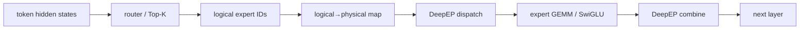
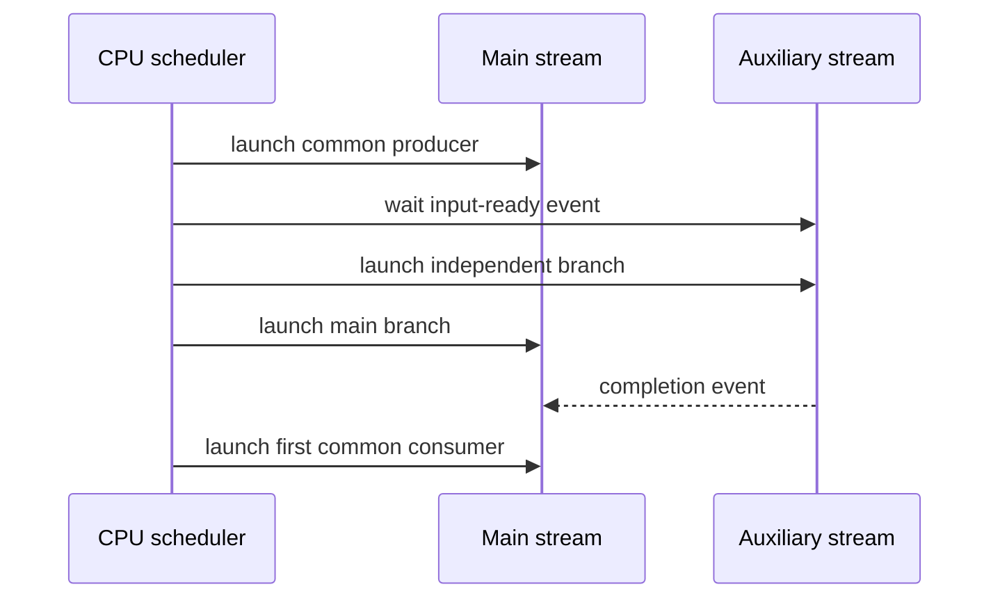
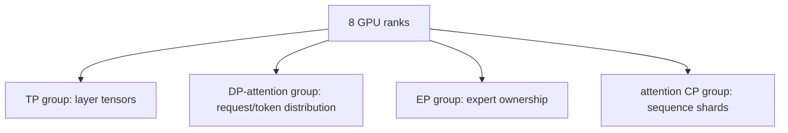

# CUDA、MoE 与三条执行图：面向初学者的解释

## 1. 当前到底测什么

当前正式请求不是“从零处理 100K token”，而是：

```text
90,000 logical shared prefix
  └─ page=64，实际 cache hit 89,984，尾部 16 token 重算
10,000 new suffix
1 output token
```

系统读取长 KV cache，对新 suffix 做增量 prefill，然后产生第一个 token。因此主指标是 TTFT；output=1 意味着没有稳定 decode 区间，不能从这个实验推导 TPOT。

## 2. GPU 基础比喻

- CPU 是调度员：准备 batch、发起 CUDA kernel 和 collective。
- kernel 是一条 GPU 工作指令，例如矩阵乘、attention 或通信搬运。
- SM 是执行 thread block 的“车间”。
- stream 是按顺序提交工作的队列；有两个 stream 不代表一定并发。
- HBM 是大容量显存；shared memory/register 更快但更小。

如果 CPU 被固定在 500 MHz 的异常核上，GPU 可能因为 kernel launch 或 collective 控制消息来得太晚而空等。反过来，通信 kernel 如果长期占太多 SM，也可能挤压 GEMM/attention。因此本项目既优化 GPU 计算，也优化通信与 CPU 控制路径。

## 3. TP、DP、EP、CP 为什么都能是 8

它们是不同维度的 process group，同一组 8 张 GPU 可以同时承担多个角色：

| 并行 | 拆什么 | 当前值 | 主要代价 |
|---|---|---:|---|
| TP | 层内张量/矩阵 | 8 | all-reduce/all-gather |
| DP | 请求或 attention 数据 | 8 | 调度与 rank 负载偏斜 |
| EP | MoE experts | 8 | dispatch/combine all-to-all |
| attention CP | 上下文序列位置 | 1 | 本 cell 没有做 CP8 attention 切分 |

所以 TP8/DP8/EP8 不代表 512 张 GPU。用户最初所说 CP8 在本次归档里实际对应 8 路 DP-attention/上下文分发；真实 attention CP8 必须作为新的 workload cell 另测。

## 4. MoE 一层如何执行



Router 决定每个 token 去哪些 expert。Expert placement 决定这些 expert 位于哪张 GPU。DeepEP dispatch 把 token 发到目标 GPU，expert 做计算，再由 combine 把结果送回。任意一个 rank 晚到，其他 rank 可能在 notify/wait kernel 里等待。

N6 把 `logical→physical map` 合进 router kernel，并用 balanced placement 缩小最慢 rank；它不是简单地“让一个 GEMM 更快”。

## 5. 三条执行图必须同时看

### 5.1 Compute DAG

```text
QKV / indexer → FlashMLA attention → router → expert GEMM/SwiGLU → output
```

FlashMLA、QKV、SwiGLU 的 leaf benchmark回答“局部算术是否更快”。

### 5.2 Communication DAG

```text
DP/TP collective → DeepEP dispatch → expert compute → DeepEP combine → next collective
```

Expert placement、DeepEP SM/chunk 和 equal-allgather 修改的是这条图。

### 5.3 Control DAG

```text
CPU scheduler → batch progression → CUDA launch/event → rank arrival → notify/wait
```

Overlap scheduler、PrefillDelayer、cpuset/affinity 修改的是这条图。v5 的 matched Nsys 也主要显示 control/arrival tail 的变化。

## 6. 为什么 leaf 快、E2E 可能慢

Amdahl 定律告诉我们：若某 kernel 只占关键路径的 1%，即使它快 50%，理论上最多也只改善约 0.5%。而且“GPU kernel 累计时间”不能直接当 wall time，因为多 GPU、多 stream、多个请求会重叠。

最典型的两个反例：

- indexer leaf 快 26.5%–29.1%，但在 10 秒 trace 里累计约 9.17 ms，服务 formal 只有 1/3 wins；
- contiguous SwiGLU+FP8 leaf 快 59.1%，但 E2E P50 慢 1.56%、P90 慢 18.61%、吞吐低 6.01%。

所以局部百分比不能相加，也不能替代 no-profiler server E2E。

## 7. Nsys 与 NCU 各回答什么

Nsys 看系统时间线：哪个 rank 在等、kernel 是否重叠、CPU launch 是否及时、collective tail 是否缩短。NCU 深入一个明确 kernel：访存、寄存器、occupancy、warp stall 等。正确顺序是先用 E2E 确认现象，再用 Nsys 定位关键路径，最后只在必要时对单 kernel 使用 NCU。

## 8. CUDA 的执行层次

CUDA 把一次 kernel launch 组织成四层：

```text
grid
└── thread block / CTA
    └── warp（NVIDIA 上通常 32 threads）
        └── thread
```

- **thread** 执行一条数据路径，例如处理一个元素或一个 tile 中的一部分。
- **warp** 是硬件调度的基本线程组。warp 内分支方向不同会产生 divergence，路径通常要分批执行。
- **thread block / CTA** 被放到一个 SM 上执行；block 内线程可通过 shared memory 和 barrier 协作。
- **grid** 是一次 kernel 的全部 blocks。不同 blocks 通常不能使用普通 block barrier 相互同步。

GPU 的高吞吐来自“大量 warp 轮换”。一个 warp 等 HBM 数据时，SM 可调度另一个 ready warp。因而 CUDA 优化经常不是让一条指令延迟更短，而是保证有足够独立工作隐藏延迟。

### 8.1 Occupancy 不是越高越好

Occupancy 粗略表示一个 SM 上实际驻留 warp 数相对硬件上限的比例。它受以下资源共同限制：

- 每线程寄存器；
- 每 block shared memory；
- threads/block；
- blocks/SM 与 warps/SM 的硬件上限；
- cluster/cooperative launch 的额外约束。

低 occupancy 可能无法隐藏访存延迟，但高 occupancy 也不自动等于快。一个 Tensor Core kernel 可能用较多寄存器和 shared memory，却以更少指令、更高数据复用完成工作。正确问题是：“当前 kernel 是否因可运行 warp 不足而让 SM 空等？”而不是追求 100% occupancy。

### 8.2 寄存器和 shared memory 为什么会让 fusion 变慢

融合把多个阶段放进同一个 kernel，可能删除中间张量和 launch；同时也会扩大变量 live range，使每线程寄存器增加，并把各阶段的 shared-memory 需求叠加。结果可能是：

1. 每个 SM 能驻留的 blocks 变少；
2. spill 把寄存器数据写到较慢的 local/global memory；
3. 一个阶段等待另一个阶段，原本可并发的工作被串行化；
4. persistent/cooperative CTA 占满 SM，辅助 stream 的 producer 无法获得驻留槽，甚至失去 forward progress。

这解释了为什么“kernel 数变少”不能单独作为优化目标。

## 9. GPU 内存层次

可以用“容量越大，通常离计算越远”来记：

| 层次 | 可见范围 | 特点 | 本项目中的例子 |
|---|---|---|---|
| register | 单 thread | 最快、最小；过多会降低驻留 | Top-K 状态、GEMM accumulator |
| shared memory | 单 block/cluster | 显式管理，可做 tile 复用 | Q/KV tile、pipeline stage buffer |
| L1 / texture | SM 附近 | 硬件缓存，行为依访问模式而变 | 局部 page/index 数据 |
| L2 | 全 GPU | 跨 SM 共享 | 重复 KV/page metadata 访问 |
| HBM | 全 GPU | 容量大、带宽高但延迟长 | 权重、KV cache、activation |
| NVLink / network peer memory | 跨 GPU | 需要通信协议与同步 | DeepEP dispatch/combine |

优化内存流量时要问：

- 数据是不是重复读取？
- producer 能否直接写 consumer 需要的 layout？
- 是否为了通信先生成宽格式，再在接收端压缩？
- 中间 tensor 是否只被下一个 kernel 使用一次？
- page/index/scale metadata 是否在每层重复构造？

FlashMLA clustered/KDA 思想试图让相邻 query CTA 复用 KV tile；它只有在“减少的 KV 流量”大于 cluster 调度、寄存器、shared memory 和同步成本时才会赢。GLM 的 head 数、page、M shape 与 DeepSeek-V4 不同，所以原理可迁移，物理实现不能照搬。

## 10. GEMM 与 Tensor Core

Transformer 的大部分计算最终落到矩阵乘：

```text
C = A × B + optional epilogue
```

GPU 不会逐元素朴素计算，而是把矩阵切成 tile：block 负责较大 tile，warp 负责子 tile，Tensor Core 执行小型矩阵乘累加。性能取决于：

- M/N/K shape 是否适合 tile；
- dtype 与量化格式；
- 权重/activation 的 layout 和对齐；
- 每个 tile 的数据复用；
- pipeline stage 数；
- epilogue 是否能直接产生下游 layout；
- ragged MoE expert load 是否造成大量 padding。

这就是 alignment 优化会随 workload 反转的原因：decode 的小 M 可能因减少 padding 而受益；prefill 的大 M 若强行换 tile/alignment，反而增加无效计算或破坏原有 pipeline。N26 在 M1024 上的 W13/W2 明显变慢，证明“decode 最优 tile”不能全局启用。

## 11. Stream、event 与同步

同一 CUDA stream 中的工作按提交顺序执行；不同 stream 允许并发，但实际是否并发取决于依赖和资源。



有效 overlap 必须满足：

1. 两个分支在 join 前确实独立；
2. tensor 生命周期覆盖两个 stream；
3. event 只表达必要依赖，不做 device-wide sync；
4. 两边没有同时吃满同一资源；
5. Nsys timeline 看到物理重叠，而不只是代码里创建了两个 stream。

本项目的 SBO、native overlap scheduler 和 PrefillDelayer 都说明“数学正确”不等于关键路径缩短。尤其 native overlap scheduler 改变 host/device batch progression 后，P50 和吞吐严重回退；没有 profile 时只能说该 treatment 在冻结 cell 中更慢，不能补造具体 CUDA 争用原因。

## 12. CUDA launch 与 CPU 为什么重要

CUDA kernel 通常由 CPU 发起。服务路径还需要 CPU：

- 组 batch 和更新 scheduler 状态；
- 准备 shape、pointer、page table 与通信 descriptor；
- 调用 CUDA/NCCL/DeepEP API；
- 记录 event、处理完成状态；
- 驱动多个 rank 以接近的节奏前进。

因此 GPU 利用率低不一定是 GPU 算力不足。若 CPU 跑在约 500 MHz 的异常频域，kernel launch、collective control 和 rank arrival 都可能变慢。本项目后期 host 故障中，只有一部分物理核稳定约 3.6 GHz；cpuset-safe affinity 能防止 worker 逃出父 mask，却无法修复平台频率故障，所以它是鲁棒性 primitive，不是已晋级的性能候选。

## 13. Attention 与 KV cache

自注意力可抽象为：

```text
scores = Q × Kᵀ
probabilities = softmax(scores)
output = probabilities × V
```

长上下文的 K/V 很大，服务通常把历史 token 的 K/V 放入 paged KV cache。当前请求有 90K logical shared prefix，但 page size=64，所以完整可命中的 prefix 是 89,984；剩余 16 token 与 10K suffix 一起进入增量计算。

FlashMLA 的优化对象不是单一“attention 公式”，还包括：

- page table 和 KV 地址计算；
- sparse/indexer Top-K；
- Q/KV tile 调度；
- producer/consumer pipeline；
- output 和 LSE；
- 与后续 projection/communication 的边界。

八 shape band 只对显式 M 集合 admit candidate，范围外局部走 stock path。这个结构把优化边界扩大到真实 shape 集合，同时限制风险；但 leaf-admitted 仍不等于 E2E-promoted。

## 14. MoE、expert placement 与最慢 rank

MoE router 对每个 token 选择少量 experts。假设 8 个 EP ranks 的 token 负载分别是：

```text
rank0  900
rank1  930
rank2  910
rank3  905
rank4  920
rank5  915
rank6  908
rank7 1400  <- slowest rank
```

即使前七张卡很快，combine 或下一 collective 往往要等 rank7。平均值无法描述这条关键路径，应该同时看 max load、rank arrival、P90/P99 notify tail 和每单位 capture 时间的 progress。

Balanced placement 做的是每层 expert permutation：模型仍调用同一个 logical expert，只是该 expert 的权重被放到新的 physical rank。Router 必须把 logical ID 可靠转换为 physical ID；若 map 方向反了，模型可能仍能运行但语义错误。

Temporal placement 又向前一步：总量平衡不保证每个时间窗口都平衡。v5 只替换有外部 replay 证据的层，其余层回退 N6。这是“扩大搜索空间 + 局部回退”的例子，而不是一个所有层都强制使用的新全局 map。

## 15. DeepEP dispatch/combine 在做什么

MoE 通常经历两次跨 rank 数据移动：

1. **dispatch**：按 router 结果把 token activation 发到 expert 所在 GPU；
2. **combine**：expert 计算完成后，把结果按原 token 顺序送回并组合。

DeepEP communication kernel 的 `num_sms` 决定它可使用多少 SM。过少可能让搬运变慢；过多可能影响同 GPU 上其他计算或改变调度尾部。N6 的 136→120 来自完整 MoE 服务路径中的局部搜索，不能推导为“所有 DeepEP workload 都应使用 120”。

notify/wait kernel 的 duration 也要谨慎解释：它可能主要在等远端 rank，而不是执行很多算术。Nsys 中 notify tail 变短通常说明 arrival/control 改善；若要证明通信协议本身带宽更高，还需要更直接的 bytes、timeline 和 kernel-level 证据。

## 16. TP、DP、EP、CP 的 process-group 视角

并行维度是“同一组进程如何协作”的逻辑定义，不是简单相乘：



本冻结 cell 中 TP8/DP8/EP8 可以复用同一组 8 ranks；`attn_cp_size=1` 表示没有真实 attention CP8。若未来启用 CP8，KV ownership、Q/KV shape、collective、cache capacity 和正确性边界都会变化，必须作为新 cell 重新测。

## 17. Nsys 的正确阅读顺序

1. 先确认 capture 覆盖所有相关 ranks 和稳定窗口。
2. 找用户请求对应的 GPU envelope，不先看“top kernels”。
3. 对齐各 rank，找谁最晚到 dispatch/combine/collective。
4. 看 CPU CUDA API、空洞、同步调用和 launch cadence。
5. 看 main/aux streams 是否真的重叠。
6. 用 NVTX 把 attention、router、MoE、output head 对齐到同一定义。
7. 最后再看 kernel 汇总；累计 duration 只用于发现线索，不当 wall time。

N6 的 profiled TTFT 明显受到工具扰动，所以只使用 matched profile 解释 progress、notify tail 和 mask 删除；正式收益来自 no-profiler 五对与 holdout。

## 18. 什么时候才用 NCU

NCU 适合回答精确问题，例如：

- 三 stage pipeline 是否因 shared memory 只允许一个 resident CTA？
- validity 逻辑是否增加 global loads 或寄存器？
- 某 fused kernel 是否 spill？
- block size 改变后 occupancy 与 No Eligible stall 是否改善？
- DRAM/L2/SM/Tensor Core 利用率是否支持“memory-bound”或“compute-bound”假设？

不要对全模型每个 launch 收集全部 metrics：NCU replay 会非常慢，也会改变执行环境。先用 E2E/Nsys 把问题缩小到代表性 launch，再采集最少的相关 section。v5 的 matched Nsys 指向跨 rank arrival/control tail，而非单 attention kernel，所以不跑无目标 NCU 是合理停止决策。

## 19. 从观察到结论的安全写法

| 观察 | 可以写 | 不能直接写 |
|---|---|---|
| leaf kernel -10% | 该 shape 的局部实现更快 | TTFT -10% |
| Nsys notify P99 下降 | 等待/到达长尾缩短 | 通信带宽必然提升 |
| 取消 400 次小 kernel | 删除了重复工作 | 一定产生可测 E2E 收益 |
| P50 好、P90 差 | median 有信号但 tail 回退 | 整体 accepted |
| degraded-host A-B-A 大胜 | 候选相对控制有因果信号 | 可与健康 N6 绝对值比较 |
| CUDA test bit-exact | operator contract 通过 | 整个 server 与旧 runtime 等价 |

## 20. 一套可复用的分析模板

对任何新候选，先写以下内容再动代码：

```text
Objective:
  哪个 workload cell、哪个用户指标？

Invariant:
  模型语义、请求、并行组、KV、dtype、graph/overlap 哪些不能变？

Hypothesis:
  要删除/融合/重叠什么工作？关键路径哪一段应缩短？

Risk:
  新增了哪些同步、寄存器、shared memory、通信或 fallback 风险？

Evidence:
  operator correctness -> model correctness -> no-profiler E2E -> holdout -> profile

Stop rule:
  哪些结果出现时立即拒绝，不再为漂亮数字修改门槛？
```

这比先写一个大 kernel 再寻找适合它的 benchmark 更接近可靠的端到端优化。
