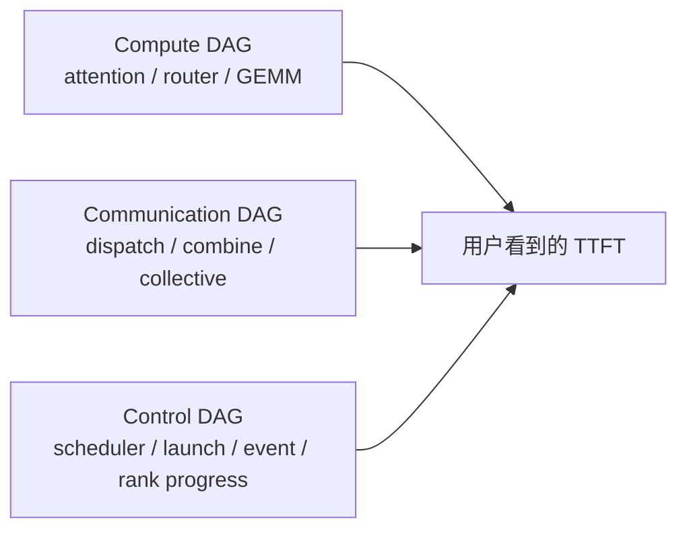
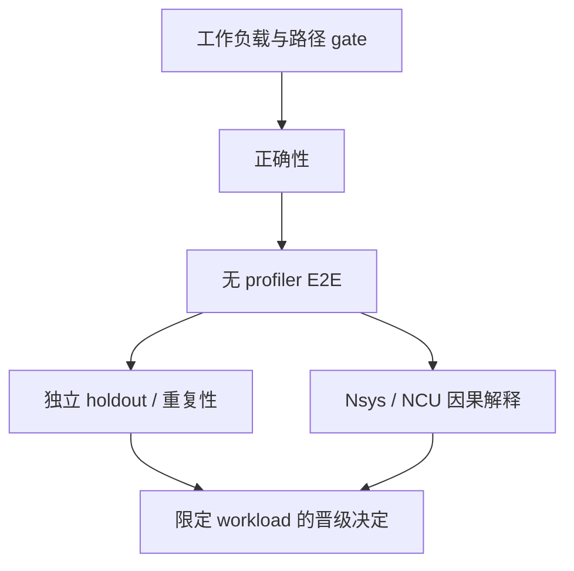
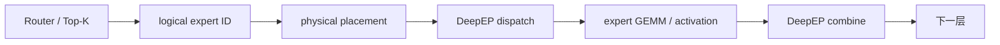

# GLM-5.2 / B300 CUDA 推理优化学习路线

这组文档既是实验记录，也是面向 CUDA 初学者的案例教材。你不需要先会写 CUDA kernel；先学会识别工作负载、关键路径、证据等级和分布式同步，再进入具体代码。

## 1. 先记住一句话

在 8×NVIDIA B300、GLM-5.2-FP8、TP8/DP8/EP8、`attn_cp_size=1`、90K logical shared prefix（实际 cache hit 89,984）+ 10K suffix、output=1、concurrency=11、110 requests 的饱和 cached-prefill 首 token 测试中，N6 将 P50 TTFT 从 2042.12 ms 降到 1933.67 ms（-5.31%）、P90 从 3035.39 ms 降到 2891.13 ms（-4.75%），total-token throughput 从 452544.29 提升到 486640.21 token/s（+7.53%）；它是 prefill/TTFT 结果，不是 decode/TPOT，也不是 attention CP8。

N6 是三个相互作用的修改：

1. balanced static expert placement；
2. fused router 直接输出 DeepEP 使用的 physical expert ID；
3. DeepEP normal dispatch/combine 的 SM 配额从 136 调到 120。

正式数字只证明三项组合，不能把三项的局部百分比相加，也不能声称每一项分别贡献了多少。

2026-08-18 的后续实验又真正建立了 TP8/DP1/attention-CP8/EP8 单元，并把每层两个 626 行 indexer 调用合成一个 1252 行调用。这个 treatment 在 CP8 内部的 concurrency=11 五对实验中，P50/P90/吞吐分别 5/5 胜，中位改善 3.30%/3.32%/3.19%；但 CP8 candidate 的 P50 仍约 3.63 秒、吞吐约 302k token/s，未超过上面的 CP1/DP-attention N6。先学会区分“优化了某个架构”和“这个架构战胜当前最佳方案”，是这轮最重要的新课程。

## 2. 三种阅读路线

### 2.1 只用 30 分钟

1. 本文：先建立术语和阅读顺序。
2. [CUDA、MoE 与三条执行图](CUDA_AND_EXECUTION_DAG_CN.md)：理解 GPU、通信和 CPU 控制为什么要一起看。
3. [实验决策速查](EXPERIMENT_DECISION_LEDGER_CN.md)：看哪些方案 accepted、rejected、blocked 或仍在 research。

读完后，你应该能解释：为什么“kernel 快 59%”仍可能让服务 P90 慢 18.61%。

### 2.2 用半天理解 N6

1. [完整系统教学报告](GLM52_B300_SYSTEMATIC_TEACHING_REPORT_20260817_CN.md)的第 0–5 节。
2. [当前 main 的逐文件修改](MAIN_CODE_CHANGE_WALKTHROUGH_CN.md)。
3. [证据与复现指南](EVIDENCE_AND_REPRO_GUIDE_CN.md)。
4. 直接查看 `../workload_contract.json`、`../evidence/n6/formal/`、`../evidence/n6/holdout/`、`../evidence/n6/correctness.json` 和 `../evidence/n6/causal_summary.json`。

读完后，你应该能从 workload contract、源代码、原始配对样本和 Nsys 派生摘要重新验证 N6 的结论边界。

### 2.3 系统学习全部实验

1. [全部实验主报告](ALL_EXPERIMENTS_MASTER_REPORT_CN.md)：按时间和工作负载解释早期 prefill、decode/MTP、route-complete、MoK、N1–N40、FlashMLA、temporal placement 与主机故障。
2. [N1–N40 完整账本](N1_N40_COMPLETE_LEDGER_CN.md)：每个候选都按“改动、机制、正确性、性能、裁决、教训”阅读。
3. [350 个实验目录索引](ALL_350_DIRECTORIES_INDEX.md)：确认归档覆盖面；目录名不等于正式 benchmark。
4. [结果文档索引](ALL_RESULT_DOCUMENTS_INDEX.md)：定位私有 compact archive 中的历史结果文件。
5. [归档覆盖与缺口](ARCHIVE_COVERAGE_AND_GAPS_CN.md)：理解哪些证据进入 GitHub、哪些只保留在私有归档，以及为什么。
6. [下一台 B300 的复验计划](NEXT_B300_VALIDATION_PLAN_CN.md)：学习如何把旧结论安全迁移到新硬件和当前 `main`。
7. [真 CP8 / EP8 教学报告](GLM52_TRUE_CP8_OPTIMIZATION_20260818_CN.md)：从 token 分段、indexer、kernel launch、局部回退、配对测试和 Nsys 因果证据，理解为什么 CP8 内部优化成功却没有替换 N6。

## 3. 先建立正确的 GPU 心智模型

一次多 GPU 推理不是“一段 CUDA 代码”，而是三张彼此依赖的图：



- **Compute DAG** 决定算多少、访存多少，以及 Tensor Core 是否高效。
- **Communication DAG** 决定哪些 token、激活或 partial result 要跨 GPU 传输。
- **Control DAG** 决定 CPU 什么时候发 kernel、各 rank 是否同步推进、stream/event 是否制造等待。

端到端时间近似“最长依赖链”，不是所有 GPU kernel duration 的总和。多个 stream、GPU 和请求会重叠；某个 rank 慢下来时，其他 rank 可能在 wait/notify kernel 中等待。

## 4. 初学者最常混淆的术语

| 术语 | 在本项目中的含义 | 常见误解 |
|---|---|---|
| TTFT | 从请求进入测量边界到第一个 token 的时间 | 当成 decode 每 token 延迟 |
| TPOT / ITL | decode 稳态每 token 或 token 间隔 | 用 output=1 的 prefill 推导 TPOT |
| prefill | 处理输入 token 并建立/读取 KV cache | 与 decode 混为一类 workload |
| cached prefill | 大部分 prefix 已在 KV cache，只处理增量 suffix | 误写成从零计算完整 100K |
| kernel | GPU 上一次并行程序 launch | 等同于整个模型或整个请求 |
| SM | 执行 thread blocks 的硬件资源 | 认为给通信越多 SM 必然越快 |
| stream | 有序提交 GPU 工作的队列 | 认为两个 stream 必然物理并发 |
| leaf benchmark | 隔离一个 kernel/算子的计时 | 直接当作 server TTFT 收益 |
| Nsys | 系统级 CPU/GPU timeline 与因果定位 | 把 profiled TTFT 当正式性能 |
| NCU | 深入少数 kernel 的访存、寄存器、occupancy、stall | 在不知道关键 kernel 时全量采集 |
| TP | 切分层内张量/矩阵 | 与 EP/DP/CP 相乘为 GPU 数量 |
| DP | 切分请求或 attention 数据 | 等同于 attention CP |
| EP | 把 MoE experts 分布到不同 rank | 只看平均负载，不看最慢 rank |
| attention CP | 沿上下文序列切分 attention | 把本实验的 DP8 误称 CP8 |

## 5. 如何判断一个性能结论是否可信

四类证据彼此正交，不能互相替代：



1. **路径 gate**：请求、shape、并行组、page、dtype、map 和 marker 必须证明实际命中候选。
2. **正确性**：先做 operator/layer，再做模型 token 和 logprob；baseline 也要自比，建立噪声底。
3. **无 profiler E2E**：正式 P50/P90/吞吐只能来自未被 profiler 扰动的 server 测试。
4. **重复性/holdout**：交错 A/B，保留每一对样本和顺序；独立 seed 防止过拟合单一请求序列。
5. **因果 profile**：Nsys 解释关键路径、rank skew、重叠和 host gap；只有问题已缩小到单 kernel 时再用 NCU。

## 6. 为什么 N6 有效，而很多漂亮的 kernel 没晋级

MoE 的关键路径包含：



N6 同时影响“expert 在哪里”“router 输出什么 ID”“通信 kernel 占多少 SM”，因此优化的是跨模块、跨 rank 的边界。它的 matched Nsys 观察到 rank progress 和 notify tail 改善，而 combine 主 kernel 的 P50 基本不变。这更像“让多张 GPU 到得更齐、删掉重复小工作”，不是“让一个大 GEMM 神奇地快 5%”。

反例也同样重要：

- indexer-Q leaf 快 26.5%–29.1%，但实际关键路径占比太小，组合 formal 只有 1/3 wins；
- contiguous SwiGLU+FP8 leaf 快 59.1%，E2E P50/P90/吞吐却分别回退 1.56%/18.61%/6.01%；
- FlashMLA 八 shape band 的 leaf 快 8.82%–12.49%，但退化主机上没有形成健康、可晋级的 E2E 证据。

这些不是“失败数据”，而是用来关闭错误优化分支的证据。

## 7. 如何读代码而不先会写 Triton/CUDA

按数据所有权和不变量读，不要从 kernel 指令开始：

1. 在 `topk.py` 找 admission gate：什么条件才能选择优化路径？
2. 在 `moe_fused_gate.py` 找输入/输出：logical ID 在哪里变成 physical ID？padded row 为什么写 `-1`？
3. 找后处理的 skip 条件：已经在 router 完成的 remap/mask 是否被再次执行？
4. 看两个 CUDA tests：哪些 shape、ragged boundary、dtype 和 ABI 被锁定？
5. 看 accepted map 的 SHA：运行时是否用了同一份数据 SSOT？
6. 看启动参数：DeepEP 120 是配置，不是 `deepep.py` 的隐藏改动。

只要能回答“谁产生数据、谁消费、shape/dtype/layout 是什么、跨不跨 rank、哪里同步”，你就已经在做有效的 CUDA 系统分析。

## 8. 建议练习

### 练习 A：从样本复算 N6

打开 `../evidence/n6/formal/samples.tsv`，按配对顺序检查 baseline/candidate 的 P50、P90 和 throughput；再与 `summary.json` 对照。不要只抄最终百分比。

### 练习 B：区分 correctness 与 holdout

分别打开 `../evidence/n6/correctness.json` 和 `../evidence/n6/holdout/summary.json`。前者回答语义是否一致，后者回答独立 seed 下性能是否复现。它们不是同一组请求。

### 练习 C：做一次 Amdahl 上界估算

假设某 kernel 占关键路径 2%，leaf 快 40%。即使没有任何额外开销，理论 E2E 上限也只有约 `0.02 × 0.40 = 0.8%`。然后思考 launch、同步和资源竞争为何可能让实际结果更小。

### 练习 D：判断是否真的命中 N6

检查启动配置、map SHA 和日志 marker。若缺少：

```text
GLM-5.2 router static-placement fusion selected
```

即使 server 正常完成，也不能把结果标成 N6 router fusion。

## 9. GitHub 与私有归档的边界

GitHub 保存：

- 当前 `main` 上 default-off 的 N6 router runtime path 与 CUDA tests；
- accepted N6 map 与 research-only v5 map/tooling；
- 冻结 workload contract；
- N6 formal、holdout、correctness 和 causal compact evidence；
- v5 correctness、A-B-A 和 causal compact evidence；
- 全部主要实验的教学报告、N1–N40 账本和 350 目录目录级索引。

私有归档继续保存：raw Nsys/SQLite、server logs、模型/数据、容器层、内部环境元数据、未公开 worktree/bundle 及 7,056 个 compact 历史证据文件。目录索引中的 `private-archive:` 标识是恢复线索，不是 GitHub 内可点击文件。

这种分层不是“少保存结果”：正式结论和可公开证据进入 Git，体积大、含内部信息或许可边界不清的原始材料由私有归档负责恢复。

## 10. 当前最重要的限制

- accepted 只适用于冻结 100K cached-prefill cell；不能外推到 decode、continuous batching、其他 context、其他 EP size 或真实 attention CP8。
- 当前 `main` 是从冻结 runtime 做的 source-reviewed port，尚未在新的健康 B300 上重新跑正式 A/B。
- v5、cpuset-safe affinity 和 FlashMLA band 都是 research candidates，不替代 N6。
- true attention CP8 / EP8 已建立独立合同并完成内部优化，但当前服务结果仍慢于 accepted N6；它是 research cell，不替代 N6。
- true-CP8 最小代码已 default-off 移植到当前 `main`，但这个新 `main` 端口尚未在 B300 上重跑；不能把冻结 runtime 的通过状态自动转移到新 revision。
