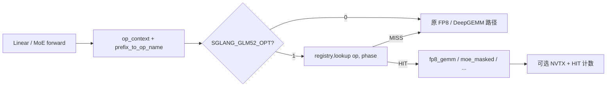

# GLM-5.2 算子替换与单算子对比测试

本文说明 SGLang-DGMK 中 `glm52_opt` **如何把 Kernel-Harness 优选算子接到 serving 路径**，以及如何用环境变量做 **OPT0 / 单算子 / 全量** A/B 与 nsys 观察。

## 1. 总体思路

默认 SGLang FP8 linear / MoE 走生产路径（DeepGEMM packed UE8M0、PDL 等）。  
开启 `SGLANG_GLM52_OPT=1` 后，在 **量化 apply 入口** 先尝试 `glm52_opt` 分发：

1. 用 layer `prefix` 映射成逻辑算子名（如 `q_b_proj`）
2. 用 forward 模式 + token 数推断 `decode` / `prefill`
3. 在 registry 查 `(op, phase)` 是否有替换规格
4. 命中则跑优化实现并返回；未命中则回落原路径

因此「替换」不是改权重或改模型结构，而是 **同 shape 的 GEMM/MoE 实现热切换**。



## 2. 关键代码路径

| 步骤 | 位置 | 作用 |
|------|------|------|
| 保存 prefix | `layers/linear.py` (`LinearBase.prefix`) | 没有 prefix → `prefix_to_op_name` 失败 → 全部 `untagged` MISS |
| 打标签 | `quantization/fp8.py` | `with op_context(prefix_to_op_name(...))` |
| FP8 入口 | `quantization/fp8_utils.py` | `try_dispatch_fp8_gemm(...)`，非 None 则直接返回 |
| MoE 入口 | `moe/moe_runner/deep_gemm.py` | `op_context("moe_gate_proj" / ...)` + `try_dispatch_moe_masked` |
| 分发 | `glm52_opt/dispatch.py` | enable / lookup / HIT·MISS / NVTX |
| 注册表 | `glm52_opt/registry.py` | `(op, phase) → KernelSpec` |
| 实现 | `fp8_gemm.py` / `moe_masked.py` / archive | native_fork / native_packed / archive Triton |
| 配置 | `glm52_opt/config.py` | env + 侧写文件 `SGLANG_GLM52_ENV_FILE` |
| Worker 日志 | `managers/scheduler.py` | `glm52_opt worker: enabled=... ops=...` |

### 2.1 Prefix → 算子名

`context.prefix_to_op_name` 取 prefix 叶子名并映射，例如：

- `q_b_proj` → `q_b_proj`
- indexer `wq_b` → `index_q_upproj`（与 attention Q-B 的 shape/并行方式不同）
- `fused_qkv_a_proj*` / `q_a_proj` → `fused_qkv_a_proj`
- `o_proj` → `o_proj`
- `w13` / `gate_up_proj` → `moe_gate_proj`
- `w2` / `down_proj` → `moe_down_proj`
- `wk` → `index_k_proj`，`q_up_proj` → `index_q_upproj`
- 融合 `wk_weights_proj` → `index_wk_weights_proj`；它是 BF16 `[6144,160]`，
  不得复用旧的独立 `index_weights_proj` `[6144,32]` kernel

### 2.2 FP8 GEMM 三条实现

`fp8_gemm.run_fp8_gemm`（与 harness 赢家对齐）：

| 算子 | 路径名（HIT kind） | 实现要点 |
|------|-------------------|----------|
| `q_b_proj` (decode) | `native_fork` | DeepGEMM-GLM52 overlay；旧实现只收 f32 scale，生产 packed 输入默认拒绝适配 |
| `o_proj` | `native_packed` | 与生产 packed UE8M0 + `fp8_gemm_nt` 同族（常接近 noop） |
| 其它 registry FP8 | `archive` | 加载历史 candidate；生产 packed 输入默认 fail-closed，不再静默 unpack |

MoE decode 走 `moe_masked`（pack 路径）。当 W2 与 DeepEP/TBO overlap 或使用
recipe-aware FP4/MXFP8 时，替换会被跳过，避免丢失 `enable_overlap/signal` 以及
改变返回值契约。B200 上 GLM-5.2 的 FP8 KV
decode 实际走 FlashInfer `trtllm_batch_decode_with_kv_cache_mla`
（`backend="trtllm-gen"`）；旧 `flash_mla_sparse` DSA archive 不代表该生产基线，
也不会替换原生 TRT-LLM 分支。

## 3. 环境变量与单算子对比

侧写文件（推荐）避免 DP worker 丢 env，默认：

`/home/ubuntu/wwxq/cache/sglang/glm52_opt.env`  
或仓库内 `glm52_opt/runtime.env`，由 `SGLANG_GLM52_ENV_FILE` 指定。

| 变量 | 含义 |
|------|------|
| `SGLANG_GLM52_OPT` | `0`=全关（OPT0）；`1`=开 |
| `SGLANG_GLM52_OPT_PROFILE` | 默认 `serving_safe`；另有显式实验用 `decode_max` / `full` / `q_b_only` |
| `SGLANG_GLM52_OPT_OPS` | 逗号白名单，与 profile 表 **求交**，用于单算子 ablation |
| `SGLANG_GLM52_OPT_M_BUCKETS` | 每个算子的本地 M 白名单，例如 `q_b_proj:16`；未命中的 M 保留原生实现 |
| `SGLANG_GLM52_ALLOW_ABI_ADAPTER` | 默认 `0`；设 `1` 才允许 packed scale 解包给旧 f32 candidate |
| `SGLANG_GLM52_MANIFEST` | `glm52_opt/manifest.json`（archive / DeepGEMM overlay） |
| `SGLANG_GLM52_DEEPGEMM_VARIANT` / `OVERLAY` | DeepGEMM-GLM52 fork |
| `SGLANG_GLM52_OPT_HIT_FILE` | HIT/MISS JSON（默认 `.../glm52_opt_hits.json`） |

### 3.1 对比配置示例

**OPT0（基线）**

```bash
SGLANG_GLM52_OPT=0
SGLANG_GLM52_OPT_PROFILE=serving_safe
```

OPT0 现在在 dispatch 入口直接返回，不记录 MISS、NVTX 或 hit-file，避免基线被
观测逻辑污染。

**只试 `q_b_proj`**

```bash
SGLANG_GLM52_OPT=1
SGLANG_GLM52_OPT_PROFILE=serving_safe
SGLANG_GLM52_OPT_OPS=q_b_proj
SGLANG_GLM52_OPT_M_BUCKETS=q_b_proj:16
```

上例只替换 `q_b_proj@M16`；`q_b_proj@M32` 的 lookup 返回空并立即回落生产
DeepGEMM。若两个 bucket 都通过，写成 `q_b_proj:16|32`。多个算子可写成
`q_b_proj:16,moe_down_proj:32`。`OPT_M_BUCKETS` 只限制 shape，不会自行启用算子，
因此仍需把算子列入 `OPT_OPS`。

当前 fork 仍需要 f32 scale，因此 production packed 输入会记录
`run_skipped:packed_abi_requires_adapter` 并回落原生 DeepGEMM。仅为了复现旧 B300
实验时才设置 `SGLANG_GLM52_ALLOW_ABI_ADAPTER=1`；正式优化应让 candidate 原生接收
packed int32 UE8M0。

**只换 fused QKV / o_proj / MoE**

```bash
SGLANG_GLM52_OPT_OPS=fused_qkv_a_proj
SGLANG_GLM52_OPT_OPS=o_proj
SGLANG_GLM52_OPT_OPS=moe_gate_proj,moe_down_proj
```

**全量 decode 替换（仅历史复现实验，不作为部署默认）**

```bash
SGLANG_GLM52_OPT=1
SGLANG_GLM52_OPT_PROFILE=decode_max
# 不设 OPT_OPS
```

每次改 env 后需 **重启 serve**。Scheduler 日志应出现：

```text
glm52_opt worker: enabled=True profile=serving_safe variant=... ops=['q_b_proj'] m_buckets={'q_b_proj': [16]}
```

并出现 `glm52_opt HIT fp8_gemm/native_fork:q_b_proj:decode:m16` 等。M32 回退会记录
`no_spec:q_b_proj:decode:m32`；HIT/MISS 与 NVTX 都带 M，因而可以核对是否只替换了
目标 bucket。无 HIT 的配置（如部分 `index_*`）说明 serving 路径未走到该 tag
（融合 / 后端差异），对比无意义。

## 4. 如何确认「真的换上了」

1. **日志**：首次 HIT/MISS 会 print + logger  
2. **计数文件**：`glm52_opt_hits.json` 的 `hits` / `misses`  
3. **Nsight**：开启 `SGLANG_GLM52_NSYS_GATE=1`，对 serve 使用  
   `nsys profile -c cudaProfilerApi ...`，触发 trigger 文件后搜 NVTX  
   `glm52_opt/fp8_gemm/<op>/decode/m16`、`glm52_nsys_window`

单算子 nsys 脚本示例（机器侧）：`run_nsys_op_single_ablation.sh`，结果目录形如 `bench_results/nsys_op_single/`。

## 5. 解读对比结果时的注意点

- **Harness「stock」≠ 生产 OPT0**：harness 基线常为 f32 block-scale DeepGEMM；生产 OPT0 已是 packed + PDL。许多「加速」相对 harness 很大，相对 OPT0 接近 noop，甚至 unpack 税导致回退。  
- **DP decode M**：该生产部署即使 `dp=8`，CUDA-graph/算子 bucket 仍是
  `M=16/32`，不能再按并发数除以 DP 得到 M=2。
- **Amdahl**：NCCL / DeepEP / MLA 占比大时，单 GEMM 收益会被稀释。  
- **实测经验（B300 / bs=16 并发）**：`q_b_only` 通常小幅正向；`fused_qkv` archive 常负向；`o_proj` / MoE pack 接近打平或略差。以本机 HIT 文件 + e2e 为准。

### 5.1 已确认的负优化机制

1. 历史 harness candidate 接收 f32 block scale，而生产已经是 packed int32 UE8M0；
   原替换每次执行 unpack、临时张量和额外 kernel，microbench 分数没有包含这笔税。
2. `o_proj` 的所谓优化和生产 DeepGEMM 基本同族，收益不足以覆盖 dispatch、输出
   分配和观测开销。
3. 原 `decode_max` 把不同 shape、后端和 GPU 上的赢家全部默认启用，没有按
   `M/DP/architecture/layout` 建 oracle table。
4. MoE 替换没有传递 DeepEP/TBO 的 overlap 参数；孤立 GEMM 可能更快，但
   `dispatch→W13→SwiGLU→W2→combine` 区域反而变慢。
5. CUDA Graph replay 下 Python NVTX/HIT 数量不等于真实调用次数，不能根据 range
   数量推断替换覆盖率。

修正后的合入门槛按 **算子 × M bucket 独立判定**：production ABI 不做在线适配、
相同 session 成对 p50 至少约 3%，并且 SGLang e2e 与完整 MoE/通信区域同时改善。
例如只有 M16 达标时只登记 M16，M32 自动保留原生实现；不要求两个 bucket 同时赢，
也不能为了 M16 的收益强制替换负优化的 M32。未达标的 bucket 只保留实验结果，
不加入部署白名单。

## 6. 相关文件索引

```
glm52_opt/manifest.json
python/sglang/srt/layers/glm52_opt/
  config.py      # env / profile / OPT_OPS / 每算子 M buckets
  context.py     # op_context / prefix 映射 / 当前 forward M
  registry.py    # 可替换算子表与 shape-selective fallback
  dispatch.py    # 分发 + HIT + NVTX
  fp8_gemm.py    # native / archive
  moe_masked.py
  nsys_gate.py   # 可选 cudaProfilerApi 窗口
third_party/kernel-archive/0720-Best-GLM-52/
third_party/deepgemm_glm52/

../Kernel-Harness/serving_native/
  workloads.py                 # 固定 TP8/DP8/EP8 的真实 ABI/shape
  runner.py                    # 调生产 SGLang/DeepEP symbol，跨 rank 取最大耗时
  candidates/allgather_torch.py
  candidates/deepep_config.py
```

## 7. 最小复现检查清单

1. `LinearBase` 已设置 `self.prefix = prefix`  
2. `PYTHONPATH` 指向本仓库 `python/`，manifest / overlay 路径正确  
3. 写好 `glm52_opt.env` 后重启，确认 worker 日志 `enabled` / `ops`  
4. 跑一小段 decode，检查 `glm52_opt_hits.json` 是否有预期 HIT  
5. 再跑 e2e / nsys；换 `OPT_OPS` 时重复 3–4

## 8. Serving-native 通信算子测试

旧 24-task suite 保持冻结，避免改变历史分数；新测试位于
`/home/qinhaiyan/Kernel-Harness/serving_native/`，只针对已验证的 B200
单机 TP8/DP8/EP8 balanced 部署。固定测试点如下：

- decode：每 DP rank 固定覆盖 `M=16`、`M=32` 两个 production bucket
- prefill：每 DP rank `M=4096`（全局 chunk 32768）
- DeepEP：hidden 6144、256 experts、top-k 8，max dispatch 128/rank
- AllGather：直接调用 SGLang
  `GroupCoordinator.all_gather_into_tensor`
- prefill/extend DeepEP：normal `get_dispatch_layout + dispatch + combine`
- decode DeepEP：low-latency `dispatch + combine`，FP8/packed UE8M0

```bash
cd /home/qinhaiyan/Kernel-Harness
serving_native/run.sh --list

# 8 卡 SGLang AllGather
CUDA_VISIBLE_DEVICES=0,1,2,3,4,5,6,7 \
  serving_native/run.sh dp_allgather_decode_m16 \
  --candidate serving_native/candidates/allgather_torch.py

# 8 卡 DeepEP normal 配置搜索；combine 也有独立 task
CUDA_VISIBLE_DEVICES=0,1,2,3,4,5,6,7 \
  serving_native/run.sh deepep_normal_dispatch_prefill \
  --candidate serving_native/candidates/deepep_config.py

# decode low-latency 基线
CUDA_VISIBLE_DEVICES=0,1,2,3,4,5,6,7 \
  serving_native/run.sh deepep_ll_dispatch_decode_m16
```

通信测试的计时结果取所有 rank 的最大 CUDA-event latency；单 rank 平均值不能
代表 serving step。DeepEP runner 复用 SGLang `DeepEPBuffer`，因此 buffer size、
AUTO-mode QP、MNNVL/fabric 与 CUDA-version 分支均和 serving 一致。最终接受仍需
同时跑 SGLang e2e，因为 dispatch/combine 与 MoE 计算/TBO overlap 的收益无法由
孤立通信耗时完全代表。

另有独立的 4 卡诊断 lane（TP4/DP4/EP4），不会覆盖上述 TP8 任务：

```bash
CUDA_VISIBLE_DEVICES=0,1,2,3 \
  serving_native/run.sh tp4_allreduce_decode_m16 \
  --candidate serving_native/candidates/allreduce_torch.py

CUDA_VISIBLE_DEVICES=0,1,2,3 \
  serving_native/run.sh ep4_deepep_ll_dispatch_decode_m16
```

它可用于 4 卡上的 backend/config 搜索，但不能把 EP4 数字直接当作 EP8 生产结果。
独立 runner 测的是 eager API；decode AllReduce 最终还要在 SGLang CUDA Graph replay
和 e2e 中复测，因为 `GroupCoordinator` 在 eager/graph 下的 backend 选择不同。
