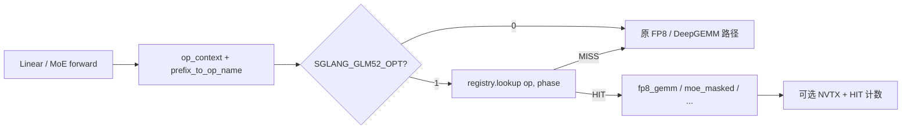

# GLM-5.2 算子替换与单算子对比测试

本文说明 SGLang-DGMK 中 `glm52_opt` **如何把 Kernel-Harness 优选算子接到 serving 路径**，以及如何用环境变量做 **OPT0 / 单算子 / 全量** A/B 与 nsys 观察。

## 1. 总体思路

默认 SGLang FP8 linear / MoE 走生产路径（DeepGEMM packed UE8M0、PDL 等）。  
开启 `SGLANG_GLM52_OPT=1` 后，在 **量化 apply 入口** 先尝试 `glm52_opt` 分发：

1. 用 layer `prefix` 映射成逻辑算子名（如 `q_b_proj`）
2. 用 forward 模式 + token 数推断 `decode` / `prefill`
3. 在 registry 查 `(op, phase)` 是否有替换规格
4. 命中则跑优化实现并返回；未命中则回落原路径

因此「替换」不是改权重或改模型结构，而是 **同 shape 的 GEMM/MoE 实现热切换**。



## 2. 关键代码路径

| 步骤 | 位置 | 作用 |
|------|------|------|
| 保存 prefix | `layers/linear.py` (`LinearBase.prefix`) | 没有 prefix → `prefix_to_op_name` 失败 → 全部 `untagged` MISS |
| 打标签 | `quantization/fp8.py` | `with op_context(prefix_to_op_name(...))` |
| FP8 入口 | `quantization/fp8_utils.py` | `try_dispatch_fp8_gemm(...)`，非 None 则直接返回 |
| MoE 入口 | `moe/moe_runner/deep_gemm.py` | `op_context("moe_gate_proj" / ...)` + `try_dispatch_moe_masked` |
| 分发 | `glm52_opt/dispatch.py` | enable / lookup / HIT·MISS / NVTX |
| 注册表 | `glm52_opt/registry.py` | `(op, phase) → KernelSpec` |
| 实现 | `fp8_gemm.py` / `moe_masked.py` / archive | native_fork / native_packed / archive Triton |
| 配置 | `glm52_opt/config.py` | env + 侧写文件 `SGLANG_GLM52_ENV_FILE` |
| Worker 日志 | `managers/scheduler.py` | `glm52_opt worker: enabled=... ops=...` |

### 2.1 Prefix → 算子名

`context.prefix_to_op_name` 取 prefix 叶子名并映射，例如：

- `q_b_proj` / `wq_b` → `q_b_proj`
- `fused_qkv_a_proj*` / `q_a_proj` → `fused_qkv_a_proj`
- `o_proj` → `o_proj`
- `w13` / `gate_up_proj` → `moe_gate_proj`
- `w2` / `down_proj` → `moe_down_proj`
- `wk` → `index_k_proj`，`q_up_proj` → `index_q_upproj`

### 2.2 FP8 GEMM 三条实现

`fp8_gemm.run_fp8_gemm`（与 harness 赢家对齐）：

| 算子 | 路径名（HIT kind） | 实现要点 |
|------|-------------------|----------|
| `q_b_proj` (decode) | `native_fork` | DeepGEMM-GLM52 overlay：`fp8_gemm_nt_fused` |
| `o_proj` | `native_packed` | 与生产 packed UE8M0 + `fp8_gemm_nt` 同族（常接近 noop） |
| 其它 registry FP8 | `archive` | 加载 kernel-archive 的 `candidate.run`；若 scale 已是 int32 UE8M0，需 **unpack→再跑**（有税） |

MoE decode 走 `moe_masked`（pack 路径）。DSA 仅在 `flash_mla_sparse` 等可 hook 后端下才有意义；生产常用 `flashmla_kv` 时 DSA archive **不会 HIT**。

## 3. 环境变量与单算子对比

侧写文件（推荐）避免 DP worker 丢 env，默认：

`/home/ubuntu/wwxq/cache/sglang/glm52_opt.env`  
或仓库内 `glm52_opt/runtime.env`，由 `SGLANG_GLM52_ENV_FILE` 指定。

| 变量 | 含义 |
|------|------|
| `SGLANG_GLM52_OPT` | `0`=全关（OPT0）；`1`=开 |
| `SGLANG_GLM52_OPT_PROFILE` | `decode_max`（仅 decode 表）/ `full`（含 prefill）/ `q_b_only` |
| `SGLANG_GLM52_OPT_OPS` | 逗号白名单，与 profile 表 **求交**，用于单算子 ablation |
| `SGLANG_GLM52_MANIFEST` | `glm52_opt/manifest.json`（archive / DeepGEMM overlay） |
| `SGLANG_GLM52_DEEPGEMM_VARIANT` / `OVERLAY` | DeepGEMM-GLM52 fork |
| `SGLANG_GLM52_OPT_HIT_FILE` | HIT/MISS JSON（默认 `.../glm52_opt_hits.json`） |

### 3.1 对比配置示例

**OPT0（基线）**

```bash
SGLANG_GLM52_OPT=0
SGLANG_GLM52_OPT_PROFILE=decode_max
```

**只换 `q_b_proj`（e2e 上通常最有收益）**

```bash
SGLANG_GLM52_OPT=1
SGLANG_GLM52_OPT_PROFILE=decode_max
SGLANG_GLM52_OPT_OPS=q_b_proj
# 或等价：SGLANG_GLM52_OPT_PROFILE=q_b_only
```

**只换 fused QKV / o_proj / MoE**

```bash
SGLANG_GLM52_OPT_OPS=fused_qkv_a_proj
SGLANG_GLM52_OPT_OPS=o_proj
SGLANG_GLM52_OPT_OPS=moe_gate_proj,moe_down_proj
```

**全量 decode 替换**

```bash
SGLANG_GLM52_OPT=1
SGLANG_GLM52_OPT_PROFILE=decode_max
# 不设 OPT_OPS
```

每次改 env 后需 **重启 serve**。Scheduler 日志应出现：

```text
glm52_opt worker: enabled=True profile=decode_max variant=... ops=['q_b_proj']
```

并出现 `glm52_opt HIT fp8_gemm/native_fork:q_b_proj:decode` 等。无 HIT 的配置（如部分 `index_*`）说明 serving 路径未走到该 tag（融合 / 后端差异），对比无意义。

## 4. 如何确认「真的换上了」

1. **日志**：首次 HIT/MISS 会 print + logger  
2. **计数文件**：`glm52_opt_hits.json` 的 `hits` / `misses`  
3. **Nsight**：开启 `SGLANG_GLM52_NSYS_GATE=1`，对 serve 使用  
   `nsys profile -c cudaProfilerApi ...`，触发 trigger 文件后搜 NVTX  
   `glm52_opt/fp8_gemm/<op>/decode`、`glm52_nsys_window`

单算子 nsys 脚本示例（机器侧）：`run_nsys_op_single_ablation.sh`，结果目录形如 `bench_results/nsys_op_single/`。

## 5. 解读对比结果时的注意点

- **Harness「stock」≠ 生产 OPT0**：harness 基线常为 f32 block-scale DeepGEMM；生产 OPT0 已是 packed + PDL。许多「加速」相对 harness 很大，相对 OPT0 接近 noop，甚至 unpack 税导致回退。  
- **DP 局部 M**：`dp=8`、全局 concurrency=16 时，每 DP 本地 M≈2，与 harness M=16/32 不同。  
- **Amdahl**：NCCL / DeepEP / MLA 占比大时，单 GEMM 收益会被稀释。  
- **实测经验（B300 / bs=16 并发）**：`q_b_only` 通常小幅正向；`fused_qkv` archive 常负向；`o_proj` / MoE pack 接近打平或略差。以本机 HIT 文件 + e2e 为准。

## 6. 相关文件索引

```
glm52_opt/manifest.json
python/sglang/srt/layers/glm52_opt/
  config.py      # env / profile / OPT_OPS
  context.py     # op_context / prefix 映射
  registry.py    # 可替换算子表
  dispatch.py    # 分发 + HIT + NVTX
  fp8_gemm.py    # native / archive
  moe_masked.py
  nsys_gate.py   # 可选 cudaProfilerApi 窗口
third_party/kernel-archive/0720-Best-GLM-52/
third_party/deepgemm_glm52/
```

## 7. 最小复现检查清单

1. `LinearBase` 已设置 `self.prefix = prefix`  
2. `PYTHONPATH` 指向本仓库 `python/`，manifest / overlay 路径正确  
3. 写好 `glm52_opt.env` 后重启，确认 worker 日志 `enabled` / `ops`  
4. 跑一小段 decode，检查 `glm52_opt_hits.json` 是否有预期 HIT  
5. 再跑 e2e / nsys；换 `OPT_OPS` 时重复 3–4
